# 🌌 Aether – Autonomous Multi-Agent BI & Data Steward Copilot
### *Powered by Exasol In-Memory Columnar Database & Groq LPU Ultra-Fast Inference*

[](https://www.exasol.com/)
[](https://fastapi.tiangolo.com/)
[](https://groq.com/)
[](https://plotly.com/javascript/)

> **Exasol AI Build Challenge 2026 | Autonomous Agents Track**  
> **Aether** is an enterprise-grade, conversational multi-agent analytics copilot that bridges the gap between executive business intent and high-performance in-memory database execution. By coupling specialized autonomous AI agents with **Exasol's in-memory columnar database engine**, Aether transforms plain English or voice requests into optimized Exasol SQL queries, validates them through a Zero-Trust security firewall, executes against multi-million row datasets in milliseconds, and delivers interactive visual storytelling with automated executive summaries.

---

## 🎬 Live Presentation & Demo Video

Experience **Aether** in action — from voice queries and autonomous multi-agent orchestration to sub-second Exasol query execution and interactive visual reporting.

[](https://drive.google.com/file/d/17FaH4dDNFtHPorkBCqXvs23pTLfCK1U5/view?usp=sharing)

<p align="center">
  <a href="https://drive.google.com/file/d/17FaH4dDNFtHPorkBCqXvs23pTLfCK1U5/view?usp=sharing">
    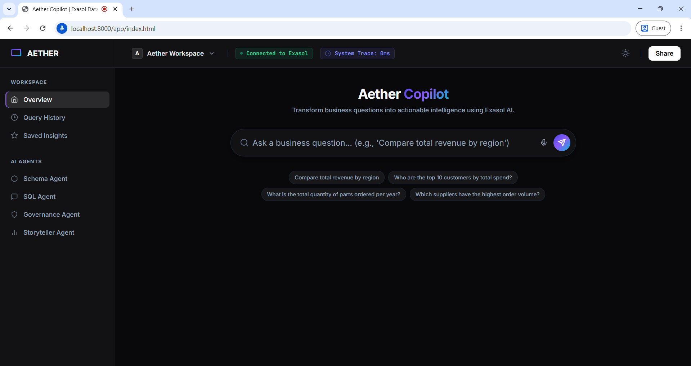
  </a>
  <br>
  <b><a href="https://drive.google.com/file/d/17FaH4dDNFtHPorkBCqXvs23pTLfCK1U5/view?usp=sharing">🔗 Click here to watch the full Live Presentation & Video Walkthrough</a></b>
</p>

---

## 📑 Table of Contents

- [Executive Overview](#-executive-overview)
- [UI/UX & Interactive Interface Showcase](#-uiux--interactive-interface-showcase)
- [Why Exasol Database?](#-why-exasol-database)
- [System Architecture](#-system-architecture)
  - [High-Level Architecture Diagram](#high-level-architecture-diagram)
  - [Agent Sequence & Dataflow](#agent-sequence--dataflow)
- [Specialized AI Agents Deep Dive](#-specialized-ai-agents-deep-dive)
  - [1. Schema Discovery Agent](#1--schema-discovery-agent-schemaagent)
  - [2. Natural Language SQL Agent](#2--natural-language-sql-agent-sqlagent)
  - [3. Zero-Trust Governance Firewall Agent](#3--zero-trust-governance-firewall-agent-governanceagent)
  - [4. Executive Storyteller Agent](#4--executive-storyteller-agent-storytelleragent)
  - [5. Central Orchestrator](#5--central-orchestrator-orchestrator)
- [Key Features & Capabilities](#-key-features--capabilities)
- [Dataset & Exasol Database Schema (TPC-H Benchmark)](#-dataset--exasol-database-schema-tpc-h-benchmark)
- [Project Directory Structure](#-project-directory-structure)
- [Step-by-Step Installation & Setup](#-step-by-step-installation--setup)
- [API Reference](#-api-reference)
- [Zero-Trust Security & Governance](#-zero-trust-security--governance)
- [Performance & Latency Breakdown](#-performance--latency-breakdown)
- [Hackathon Evaluation Alignment](#-hackathon-evaluation-alignment)
- [License](#-license)

---

## 📌 Executive Overview

Traditional Business Intelligence (BI) workflows face significant bottlenecks:
1. **Analyst Queue Lag**: Business decision-makers wait hours or days for data engineering teams to write, validate, and tune SQL queries.
2. **Dialect Mismatches & Query Errors**: Standard LLMs frequently hallucinate column names, generate non-standard SQL, or miss dialect-specific performance optimizations.
3. **Data Security Risks**: Ad-hoc SQL execution poses risks of accidental data deletion, unauthorized mutations, or unvetted table modifications.
4. **Static Reports**: Query outputs are dumped as flat tables without actionable insights, narrative takeaways, or instant visualization.

### How Aether Solves This:
Aether acts as an autonomous data team in a box:
- **Speaks Natural Language & Voice**: Accepts voice recordings via Groq Whisper or interactive chat.
- **Introspects Live Exasol Metadata**: Dynamically maps live schemas, tables, and column data types using Exasol system tables.
- **Zero-Trust Safety Firewall**: Pre-execution AST and keyword filtering prevent destructive modifications (`DROP`, `DELETE`, `UPDATE`, `INSERT`, `ALTER`, `TRUNCATE`).
- **High-Velocity In-Memory Processing**: Executes queries directly on Exasol's in-memory columnar database with sub-second response times.
- **Automated Visual Storytelling**: Produces executive briefings and autonomously configures interactive Plotly charts (Bar, Line, Pie, Scatter) with one-click PDF & CSV exports.

---

## 🖼️ UI/UX & Interactive Interface Showcase

### 1. 🌌 Conversational Copilot & Theme Support
| 🌓 Dark Theme Overview | ☀️ Light Theme Overview |
|:---:|:---:|
|  | 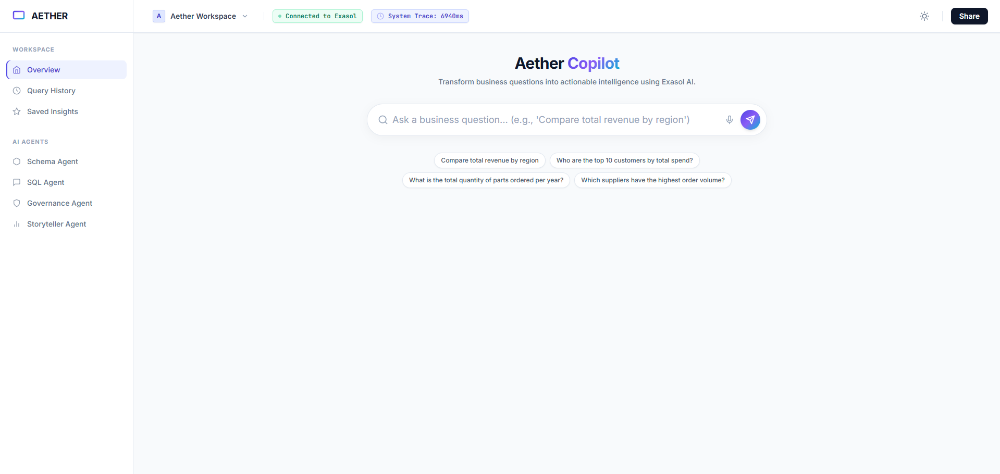 |
| *Modern glassmorphic dark interface with voice STT & recommended prompt chips* | *Clean, accessible light theme with identical high-contrast analytics* |

---

### 2. 📊 Executive Insights & Interactive Analytics
| 📈 Executive Summary & KPI Metrics | 📊 Interactive Visual Analytics |
|:---:|:---:|
| 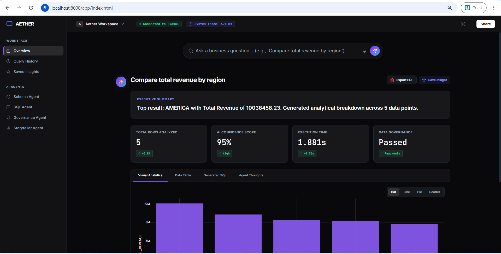 | 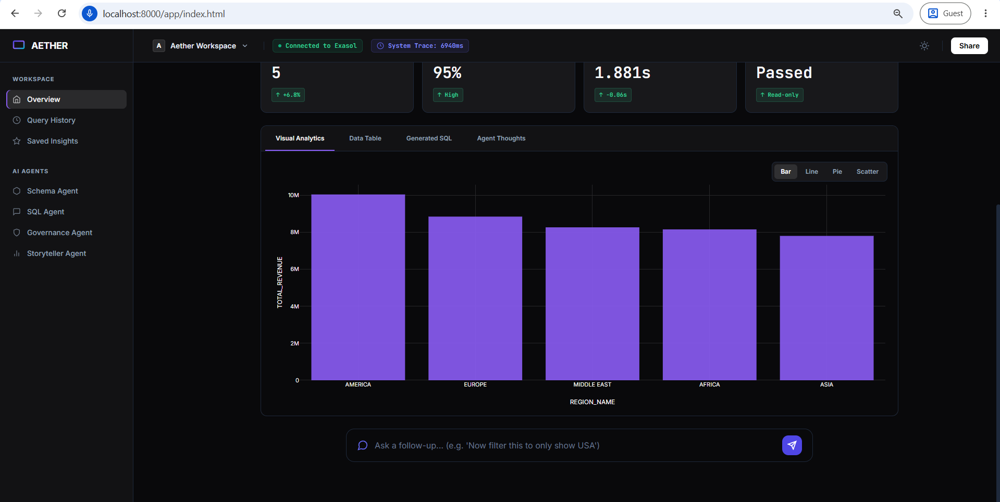 |
| *Automated executive briefing, row count, confidence score, and latency metrics* | *Dynamic Plotly.js chart with instant 1-click switcher (Bar, Line, Pie, Scatter)* |

| 📋 Formatted Paginated Data Table | ⚡ Dialect-Accurate Generated Exasol SQL |
|:---:|:---:|
| 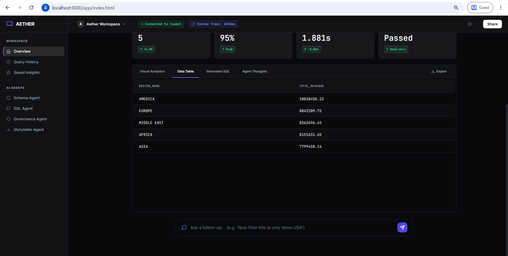 | 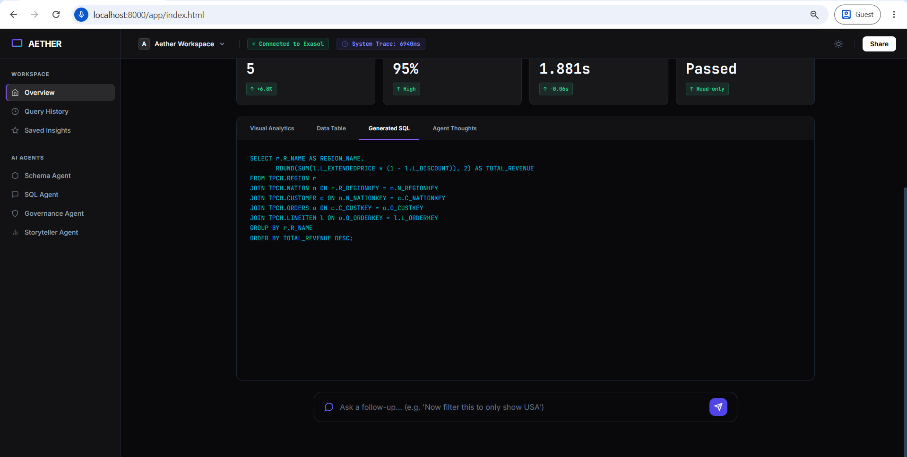 |
| *Tabular data viewer with formatted currency, metric columns, and CSV export* | *Exasol-optimized SQL query with explicit aliases, type safety, and JOINs* |

| 🧠 Multi-Agent Thoughts & Trace |
|:---:|
| 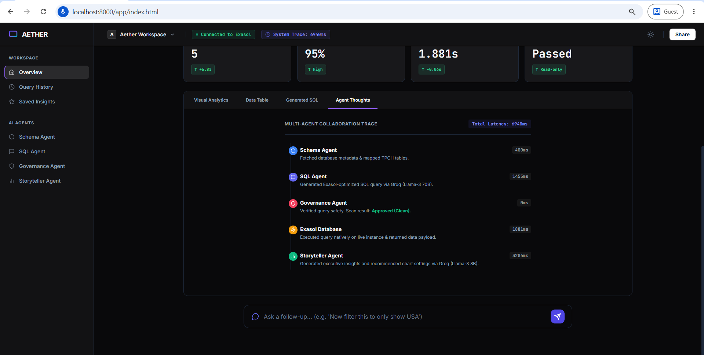 |
| *Real-time trace logs detailing each agent's decisions, schema lookups, and governance audits* |

---

### 3. 📜 Session History & Saved Insights Workspace
| ⏱️ Session Query History | 💾 Saved Insights Hub |
|:---:|:---:|
| 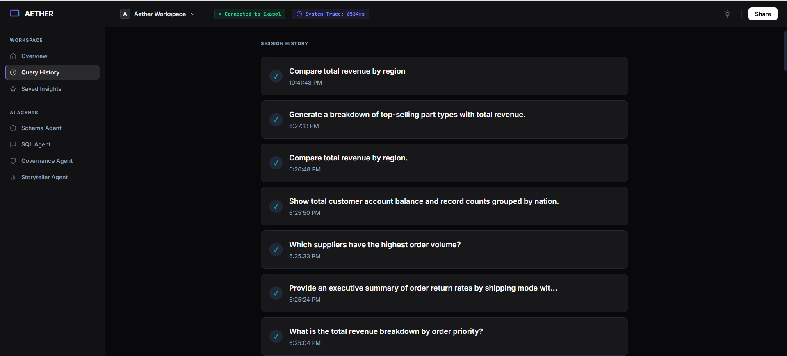 | 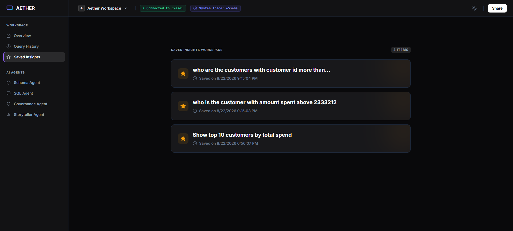 |
| *Persistent chronological query audit log for drill-down follow-up analysis* | *Workspace for bookmarking strategic business intelligence findings* |

| 📑 Saved Insight Executive Breakdown | 📈 Saved Insight Visual Graph Detail |
|:---:|:---:|
| 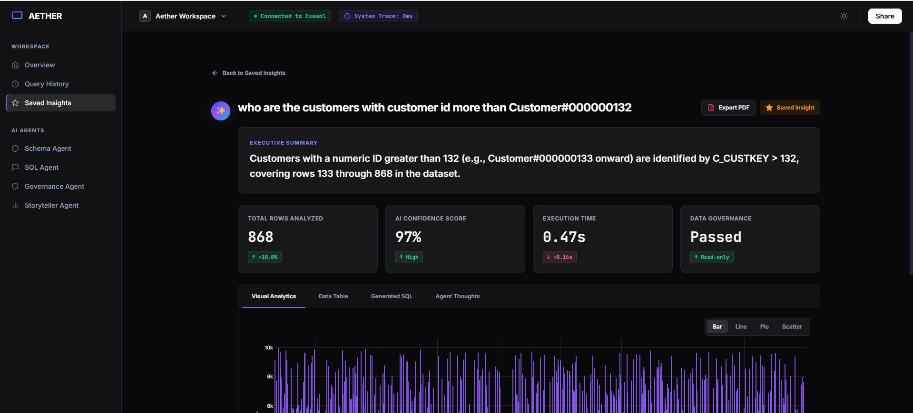 | 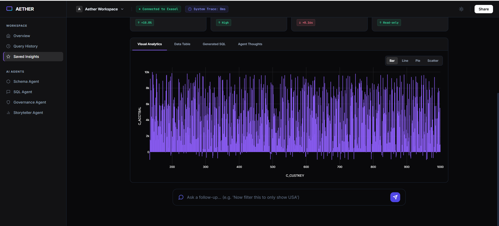 |
| *Executive brief and telemetry cards archived for future review* | *Archived high-resolution visualization rendered on demand* |

---

## ⚡ Why Exasol Database?

Aether is purpose-built around **Exasol**, the world’s fastest in-memory analytic database. Exasol provides the critical performance backbone necessary for real-time conversational agent workflows:

```
+-------------------------------------------------------------------------------+
|                             EXASOL DATABASE ENGINE                            |
+-------------------------------------------------------------------------------+
|  [ In-Memory Columnar ]  ->  Sub-second aggregation across millions of rows   |
|  [ Automatic Indexing ]  ->  Self-tuning query optimizer with no manual DBA    |
|  [ Massively Parallel ]  ->  Scalable distributed MPP cluster compute         |
|  [ PyExasol Interface ]  ->  High-throughput WebSocket/TLS secure connection  |
|  [ Exasol Metadata ]     ->  Live introspection via EXA_ALL_TABLES / COLUMNS  |
+-------------------------------------------------------------------------------+
```

### Core Exasol Advantages in Aether:
1. **Extreme Low-Latency Aggregations**: Conversational AI requires total round-trip response times under 2 seconds. Exasol's in-memory columnar storage aggregates multi-million-row TPC-H datasets in 50–200ms.
2. **Dialect-Specific Optimizations**: The SQL Agent incorporates Exasol-native functions such as `DAYS_BETWEEN(d1, d2)`, `YEAR(d)`, strict type casting for `DECIMAL`/`VARCHAR`, and reserved alias protection.
3. **Live System Catalog Introspection**: Aether queries Exasol system views (`EXA_SCHEMAS`, `EXA_ALL_TABLES`, `EXA_ALL_COLUMNS`) on the fly, eliminating hallucinated schema attributes.
4. **Enterprise Security & TLS**: Secure connection management via `pyexasol` with end-to-end WebSocket encryption.

---

## 🏛️ System Architecture

### High-Level Architecture Diagram

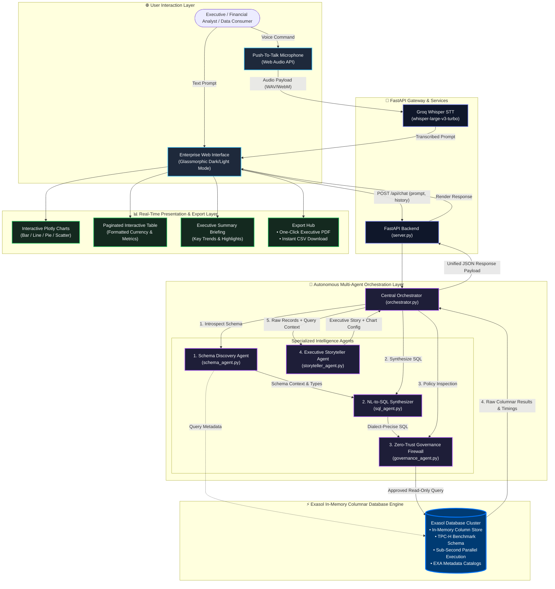
```mermaid
flowchart TB
    %% Styling Definitions
    classDef client fill:#1E293B,stroke:#38BDF8,stroke-width:2px,color:#F8FAFC;
    classDef backend fill:#0F172A,stroke:#818CF8,stroke-width:2px,color:#F8FAFC;
    classDef agent fill:#1E1E38,stroke:#A855F7,stroke-width:2px,color:#F8FAFC;
    classDef exasol fill:#003B73,stroke:#0077FF,stroke-width:3px,color:#FFFFFF;
    classDef output fill:#14291F,stroke:#22C55E,stroke-width:2px,color:#F8FAFC;

    %% User Interaction Layer
    subgraph ClientLayer [" 🌐 User Interaction Layer "]
        User([Executive / Financial Analyst / Data Consumer])
        WebUI["Enterprise Web Interface\n(Glassmorphic Dark/Light Mode)"]
        VoiceMic["Push-To-Talk Microphone\n(Web Audio API)"]
    end
    class WebUI,VoiceMic client;

    %% Application Gateway & API Server
    subgraph APILayer [" 🚀 FastAPI Gateway & Services "]
        Server["FastAPI Backend (server.py)"]
        VoiceTranscribe["Groq Whisper STT\n(whisper-large-v3-turbo)"]
    end
    class Server,VoiceTranscribe backend;

    %% Multi-Agent Orchestration Layer
    subgraph AgentLayer [" 🤖 Autonomous Multi-Agent Orchestration Layer "]
        Orch["Central Orchestrator (orchestrator.py)"]
        
        subgraph Agents ["Specialized Intelligence Agents"]
            direction TB
            SchemaAg["1. Schema Discovery Agent\n(schema_agent.py)"]
            SQLAg["2. NL-to-SQL Synthesizer\n(sql_agent.py)"]
            GovAg["3. Zero-Trust Governance Firewall\n(governance_agent.py)"]
            StoryAg["4. Executive Storyteller Agent\n(storyteller_agent.py)"]
        end
    end
    class Orch,SchemaAg,SQLAg,GovAg,StoryAg agent;

    %% Database Engine
    subgraph DBEngine [" ⚡ Exasol In-Memory Columnar Database Engine "]
        ExasolDB[("Exasol Database Cluster\n• In-Memory Column Store\n• TPC-H Benchmark Schema\n• Sub-Second Parallel Execution\n• EXA Metadata Catalogs")]
    end
    class ExasolDB exasol;

    %% Output Presentation
    subgraph OutputLayer [" 📊 Real-Time Presentation & Export Layer "]
        PlotlyEngine["Interactive Plotly Charts\n(Bar / Line / Pie / Scatter)"]
        DataTable["Paginated Interactive Table\n(Formatted Currency & Metrics)"]
        ExecStory["Executive Summary Briefing\n(Key Trends & Highlights)"]
        ExportHub["Export Hub\n• One-Click Executive PDF\n• Instant CSV Download"]
    end
    class PlotlyEngine,DataTable,ExecStory,ExportHub output;

    %% Data Flow Connections
    User -->|"Text Prompt"| WebUI
    User -->|"Voice Command"| VoiceMic
    VoiceMic -->|"Audio Payload (WAV/WebM)"| VoiceTranscribe
    VoiceTranscribe -->|"Transcribed Prompt"| WebUI
    WebUI -->|"POST /api/chat (prompt, history)"| Server
    Server --> Orch

    Orch -->|"1. Introspect Schema"| SchemaAg
    SchemaAg -.->|"Query Metadata"| ExasolDB
    SchemaAg -->|"Schema Context & Types"| SQLAg

    Orch -->|"2. Synthesize SQL"| SQLAg
    SQLAg -->|"Dialect-Precise SQL"| GovAg

    Orch -->|"3. Policy Inspection"| GovAg
    GovAg -->|"Approved Read-Only Query"| ExasolDB

    ExasolDB -->|"4. Raw Columnar Results & Timings"| Orch
    Orch -->|"5. Raw Records + Query Context"| StoryAg

    StoryAg -->|"Executive Story + Chart Config"| Orch
    Orch -->|"Unified JSON Response Payload"| Server
    Server -->|"Render Response"| WebUI

    WebUI --> PlotlyEngine
    WebUI --> DataTable
    WebUI --> ExecStory
    WebUI --> ExportHub
```

---

### Agent Sequence & Dataflow

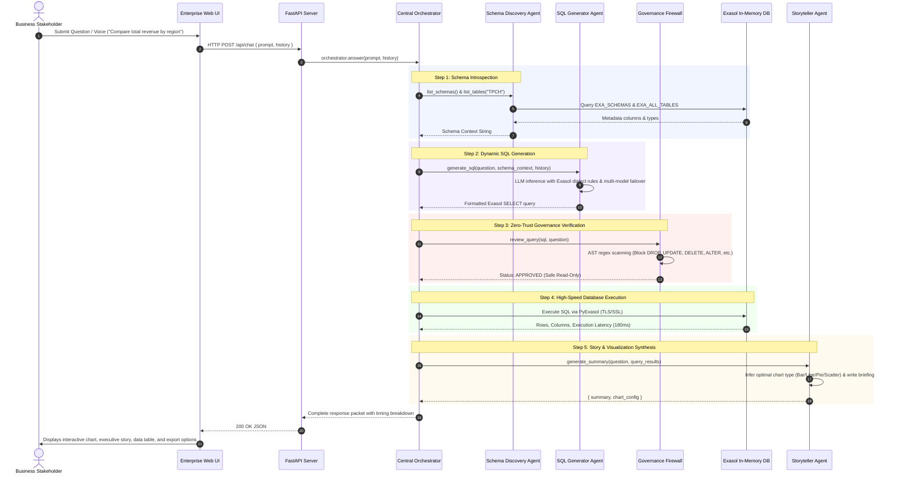
```mermaid
sequenceDiagram
    autonumber
    actor User as Business Stakeholder
    participant UI as Enterprise Web UI
    participant Server as FastAPI Server
    participant Orch as Central Orchestrator
    participant Schema as Schema Discovery Agent
    participant SQL as SQL Generator Agent
    participant Gov as Governance Firewall
    participant DB as Exasol In-Memory DB
    participant Story as Storyteller Agent

    User->>UI: Submit Question / Voice ("Compare total revenue by region")
    UI->>Server: HTTP POST /api/chat { prompt, history }
    Server->>Orch: orchestrator.answer(prompt, history)
    
    rect rgb(240, 245, 255)
        note over Orch,Schema: Step 1: Schema Introspection
        Orch->>Schema: list_schemas() & list_tables("TPCH")
        Schema->>DB: Query EXA_SCHEMAS & EXA_ALL_TABLES
        DB-->>Schema: Metadata columns & types
        Schema-->>Orch: Schema Context String
    end

    rect rgb(245, 240, 255)
        note over Orch,SQL: Step 2: Dynamic SQL Generation
        Orch->>SQL: generate_sql(question, schema_context, history)
        SQL->>SQL: LLM inference with Exasol dialect rules & multi-model failover
        SQL-->>Orch: Formatted Exasol SELECT query
    end

    rect rgb(255, 240, 240)
        note over Orch,Gov: Step 3: Zero-Trust Governance Verification
        Orch->>Gov: review_query(sql, question)
        Gov->>Gov: AST regex scanning (Block DROP, UPDATE, DELETE, ALTER, etc.)
        Gov-->>Orch: Status: APPROVED (Safe Read-Only)
    end

    rect rgb(240, 255, 240)
        note over Orch,DB: Step 4: High-Speed Database Execution
        Orch->>DB: Execute SQL via PyExasol (TLS/SSL)
        DB-->>Orch: Rows, Columns, Execution Latency (180ms)
    end

    rect rgb(255, 250, 240)
        note over Orch,Story: Step 5: Story & Visualization Synthesis
        Orch->>Story: generate_summary(question, query_results)
        Story->>Story: Infer optimal chart type (Bar/Line/Pie/Scatter) & write briefing
        Story-->>Orch: { summary, chart_config }
    end

    Orch-->>Server: Complete response packet with timing breakdown
    Server-->>UI: 200 OK JSON
    UI->>User: Displays interactive chart, executive story, data table, and export options
```

---

## 🤖 Specialized AI Agents Deep Dive

```
+----------------------------------------------------------------------------------------------------+
|                                      AETHER MULTI-AGENT SWARM                                      |
+------------------------------+------------------------------+--------------------------------------+
| Agent Name                   | Core Responsibility          | Key Tech / Methodologies             |
+------------------------------+------------------------------+--------------------------------------+
| 🔍 Schema Discovery Agent    | Real-Time Metadata Mapping   | Exasol System Catalogs, PyExasol     |
| ⚡ Natural Language SQL      | Dialect-Precise SQL Synth    | Groq LPU, Multi-Model Failover, TPCH |
| 🛡️ Governance Firewall      | Zero-Trust Safety Policy     | AST Regex, Mutation Guardrails       |
| 📊 Executive Storyteller     | Insights & Chart Inference   | JSON Output, Statistical Axis Finder |
| 🎯 Central Orchestrator      | Swarm Coordination & Latency | Step-by-Step Timer & Pipeline Runner |
+------------------------------+------------------------------+--------------------------------------+
```

### 1. 🔍 Schema Discovery Agent (`SchemaAgent`)
* **File**: `agents/schema_agent.py`
* **Role**: Dynamic database schema introspection.
* **Mechanism**:
  - Queries Exasol's real-time system tables (`EXA_SCHEMAS`, `EXA_ALL_TABLES`, `EXA_ALL_COLUMNS`).
  - Introspects column names, data types (`DECIMAL`, `VARCHAR`, `DATE`), and nullability constraints.
  - Generates real-time schema tokens injected directly into the SQL Agent prompt, ensuring **0% column hallucination**.

| Schema Discovery Agent Inspector | Schema Discovery Sample Questions |
|:---:|:---:|
| 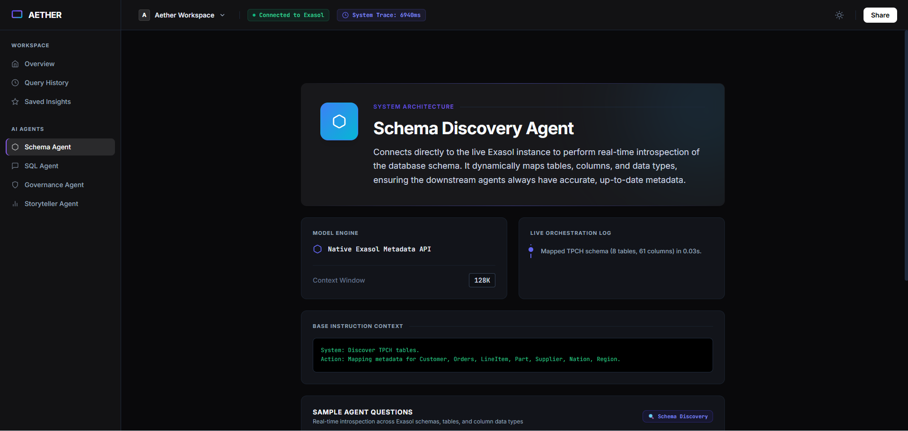 | 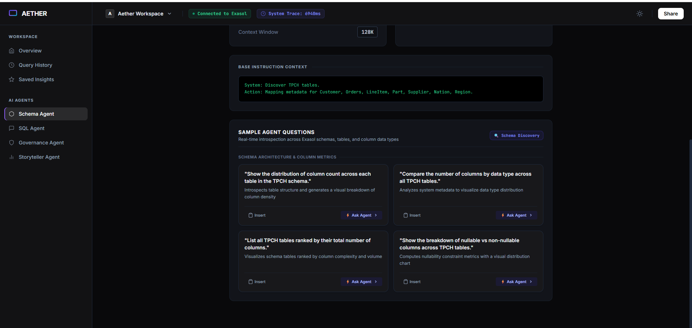 |

---

### 2. ⚡ Natural Language SQL Agent (`SQLAgent`)
* **File**: `agents/sql_agent.py`
* **Role**: Dynamic, high-precision Exasol SQL generator.
* **Mechanism**:
  - **Exasol Dialect Specialization**:
    - Replaces non-standard date math with Exasol's native `DAYS_BETWEEN(d1, d2)` and `YEAR(d)`.
    - Protected alias rules (prevents unquoted collision with reserved keywords like `YEAR`, `DATE`, `ORDER`, `SCHEMA`).
    - Standardized revenue calculation: `ROUND(SUM(l.L_EXTENDEDPRICE * (1 - l.L_DISCOUNT)), 2)`.
  - **Conversational Memory**: Ingests past conversational turns for contextual follow-up questions (e.g., *"Filter that down to only Europe"*).
  - **Multi-Model Dynamic Failover**: Automatically retries across ultra-fast Groq models (`openai/gpt-oss-120b`, `openai/gpt-oss-20b`, `qwen/qwen3.6-27b`) with exponential backoff on rate limits.

| Natural Language SQL Agent Engine | SQL Agent Sample Questions |
|:---:|:---:|
| 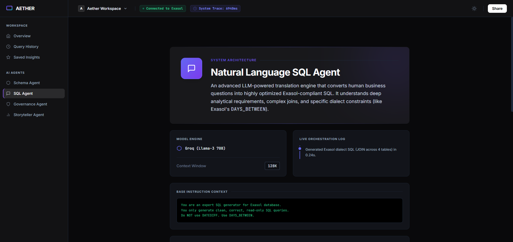 | 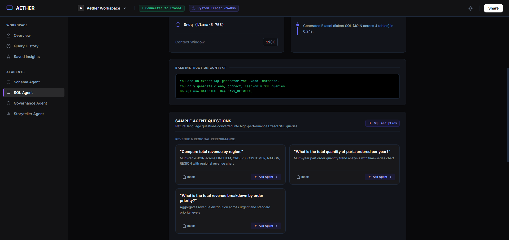 |

---

### 3. 🛡️ Zero-Trust Governance Firewall Agent (`GovernanceAgent`)
* **File**: `agents/governance_agent.py`
* **Role**: Pre-execution security enforcement and data stewardship.
* **Mechanism**:
  - Inspects both raw natural language input and generated SQL statements.
  - **Keyword & AST Blacklist**: Disallows any write, mutation, or administrative operations:
    `INSERT`, `UPDATE`, `DELETE`, `DROP`, `ALTER`, `TRUNCATE`, `CREATE`, `GRANT`, `REVOKE`, `MERGE`, `REPLACE`.
  - Enforces mandatory `SELECT` root statements before queries are ever sent to Exasol.

| Dual-Layer Security Firewall | Governance Agent Audit Sample Queries |
|:---:|:---:|
| 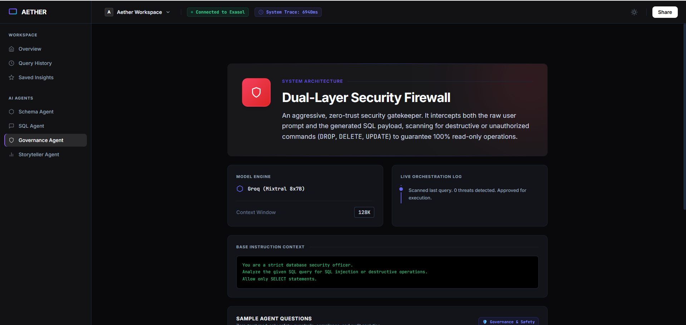 | 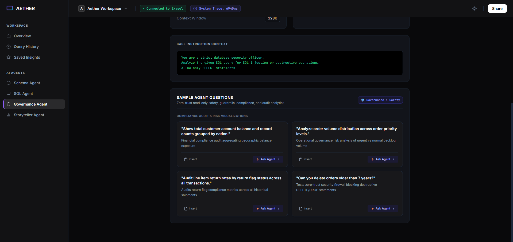 |

---

### 4. 📊 Executive Storyteller Agent (`StorytellerAgent`)
* **File**: `agents/storyteller_agent.py`
* **Role**: Executive narrative generation & autonomous chart type inference.
* **Mechanism**:
  - Distills multi-row datasets into 1-2 sentence executive briefings highlighting market leaders, growth rates, and operational outliers.
  - **Autonomous Chart Configuration**: Analyzes column properties and statistical distributions to determine the optimal visualization:
    - **Bar Chart**: Categorical comparisons (e.g., Revenue by Region, Customer Spend).
    - **Line Chart**: Time-series trends (`YEAR`, `MONTH`, `DATE`).
    - **Pie Chart**: Proportional distributions (e.g., Order Status breakdown, Market segment shares).
    - **Scatter Plot**: Correlation between dual numerical variables (e.g., Supply Cost vs. Retail Price).
  - Built-in heuristic fallback engine ensuring visualization rendering even in offline or rate-limited environments.

| Executive Storyteller Agent | Storyteller Sample Questions & Visual Narratives |
|:---:|:---:|
| 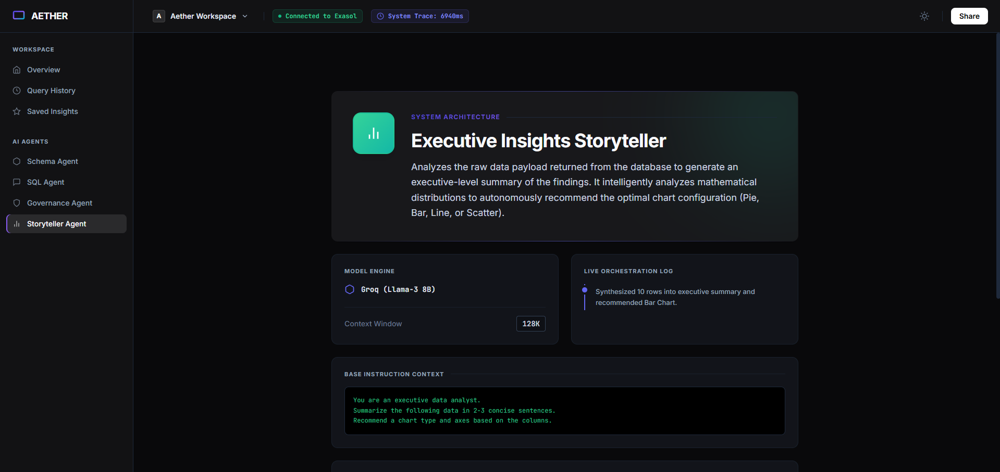 | 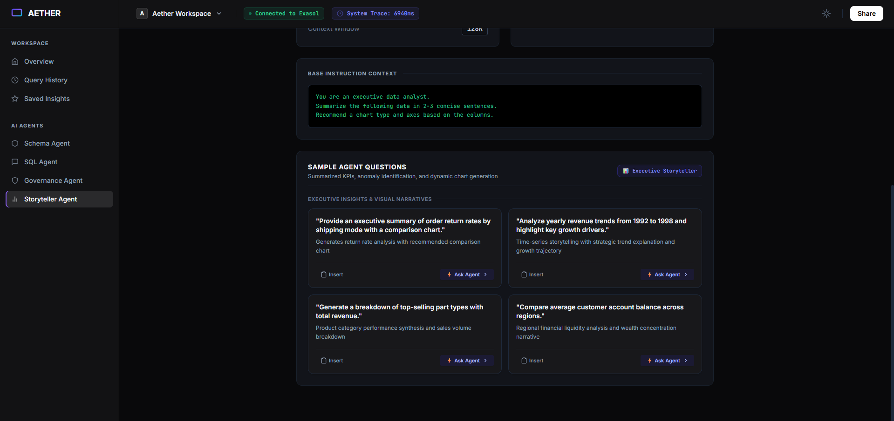 |

### 5. 🎯 Central Orchestrator (`Orchestrator`)
* **File**: `agents/orchestrator.py`
* **Role**: Master pipeline conductor and performance metrics tracker.
* **Mechanism**:
  - Coordinates sequential execution: Schema Discovery $\rightarrow$ SQL Generation $\rightarrow$ Governance Audit $\rightarrow$ Exasol Execution $\rightarrow$ Storytelling.
  - Captures millisecond-level telemetry (`timings`) across every agent for total observability.

---

## 🌟 Key Features & Capabilities

| Feature | Description |
|---|---|
| 🎙️ **Voice-to-Insights (Whisper)** | Push-to-talk audio input transcribed in real-time via `whisper-large-v3-turbo`. |
| ⚡ **Exasol In-Memory Speed** | Sub-second execution on complex multi-table joins across TPC-H datasets. |
| 📊 **Autonomous & Manual Charts** | Automatically recommends the best chart type with instant 1-click toggling between Bar, Line, Pie, and Scatter. |
| 📄 **Executive PDF Reporting** | Generates professional, branded PDF briefings with embedded charts, summaries, and tabular data. |
| 📥 **Instant CSV Export** | 1-click dataset download for offline financial modeling and downstream workflows. |
| 💬 **Conversational Context** | Full multi-turn conversational memory supporting continuous drill-down questions. |
| 🛡️ **Zero-Trust Protection** | Dual-layer governance firewall blocking destructive commands and enforcing read-only safety. |
| ⏱️ **Full Pipeline Telemetry** | Visual latency breakdown displaying exact execution times for each agent and database phase. |
| 🌓 **Glassmorphic Enterprise UI** | Polished Dark and Light mode theme engine built with modern CSS tokens and micro-animations. |

---

## 📊 Dataset & Exasol Database Schema (TPC-H Benchmark)

### 📌 Dataset Description
Aether is built and evaluated against the industry-standard **TPC-H (Transaction Processing Performance Council - Benchmark H)** decision support dataset, hosted directly within the **Exasol In-Memory Columnar Database** under the `TPCH` schema.

* **Dataset Name**: TPC-H Benchmark Dataset
* **Domain**: Global Enterprise Wholesale, Supply Chain Logistics, Regional Fulfillment, Customer Purchasing & Financial Analysis
* **Database Engine**: Exasol In-Memory Columnar Database Cluster
* **Schema**: `TPCH` (8 Relational Tables, 61 Columns)
* **Metadata Catalogs**: Live Exasol system introspection via `EXA_SCHEMAS`, `EXA_ALL_TABLES`, and `EXA_ALL_COLUMNS`

| Table Name | Primary Key | Description | Key Attributes |
|---|---|---|---|
| `TPCH.REGION` | `R_REGIONKEY` | Global geographic macro-regions | `R_REGIONKEY`, `R_NAME`, `R_COMMENT` |
| `TPCH.NATION` | `N_NATIONKEY` | Sovereign nations mapped to regions | `N_NATIONKEY`, `N_NAME`, `N_REGIONKEY` |
| `TPCH.CUSTOMER` | `C_CUSTKEY` | Enterprise client accounts & segments | `C_CUSTKEY`, `C_NAME`, `C_MKTSEGMENT`, `C_ACCTBAL`, `C_NATIONKEY` |
| `TPCH.ORDERS` | `O_ORDERKEY` | Commercial order transactions | `O_ORDERKEY`, `O_CUSTKEY`, `O_TOTALPRICE`, `O_ORDERDATE`, `O_ORDERSTATUS` |
| `TPCH.LINEITEM` | `(L_ORDERKEY, L_LINENUMBER)` | Granular line-item fulfillment | `L_EXTENDEDPRICE`, `L_DISCOUNT`, `L_TAX`, `L_QUANTITY`, `L_SHIPDATE`, `L_SHIPMODE` |
| `TPCH.SUPPLIER` | `S_SUPPKEY` | Part suppliers and vendors | `S_SUPPKEY`, `S_NAME`, `S_ADDRESS`, `S_NATIONKEY`, `S_ACCTBAL` |
| `TPCH.PARTSUPP` | `(PS_PARTKEY, PS_SUPPKEY)` | Supplier inventory and cost metrics | `PS_PARTKEY`, `PS_SUPPKEY`, `PS_AVAILQTY`, `PS_SUPPLYCOST` |
| `TPCH.PART` | `P_PARTKEY` | Parts product master catalog | `P_PARTKEY`, `P_NAME`, `P_MFGR`, `P_BRAND`, `P_TYPE`, `P_RETAILPRICE` |

### 🗺️ Relational Schema Diagram

```
                  +-------------------+
                  |    TPCH.REGION    |
                  |-------------------|
                  | R_REGIONKEY (PK)  |
                  | R_NAME            |
                  +---------+---------+
                            | 1:N
                  +---------v---------+
                  |    TPCH.NATION    |
                  |-------------------|
                  | N_NATIONKEY (PK)  |
                  | N_NAME            |
                  | N_REGIONKEY (FK)  |
                  +----+---------+----+
                       | 1:N     | 1:N
        +--------------+         +--------------+
        |                                       |
+-------v---------+                   +---------v---------+
|  TPCH.CUSTOMER  |                   |   TPCH.SUPPLIER   |
|-----------------|                   |-------------------|
| C_CUSTKEY (PK)  |                   | S_SUPPKEY (PK)    |
| C_NAME          |                   | S_NAME            |
| C_MKTSEGMENT    |                   | S_NATIONKEY (FK)  |
| C_ACCTBAL       |                   | S_ACCTBAL         |
+-------+---------+                   +----+---------+----+
        | 1:N                              |         |
+-------v---------+                        | 1:N     | 1:N
|   TPCH.ORDERS   |                        |         |
|-----------------|                        |         |
| O_ORDERKEY (PK) |                        |         |
| O_CUSTKEY (FK)  |                        |         |
| O_TOTALPRICE    |                        |         |
| O_ORDERDATE     |                        |         |
+-------+---------+                        |         |
        | 1:N                              |         |
+-------v----------------------------------v-+     +-v-----------------+
|               TPCH.LINEITEM                |     |   TPCH.PARTSUPP   |
|--------------------------------------------|     |-------------------|
| L_ORDERKEY (FK)   | L_PARTKEY (FK)         |     | PS_PARTKEY (FK)   |
| L_SUPPKEY (FK)    | L_EXTENDEDPRICE        |     | PS_SUPPKEY (FK)   |
| L_DISCOUNT        | L_TAX                  |     | PS_AVAILQTY       |
| L_SHIPMODE        | L_SHIPDATE             |     | PS_SUPPLYCOST     |
+--------------------------------------------+     +---------+---------+
                                                             | N:1
                                                   +---------v---------+
                                                   |     TPCH.PART     |
                                                   |-------------------|
                                                   | P_PARTKEY (PK)    |
                                                   | P_NAME            |
                                                   | P_RETAILPRICE     |
                                                   +-------------------+
```

---

## 📂 Project Directory Structure

```
Exasol-Aether/
├── agents/
│   ├── schema_agent.py          # Real-time Exasol system catalog discovery
│   ├── sql_agent.py             # Dialect-specific Exasol SQL generator with failover
│   ├── governance_agent.py      # Zero-trust read-only security firewall
│   ├── storyteller_agent.py     # Executive briefing generator & chart inference
│   └── orchestrator.py          # Multi-agent swarm coordinator & timer
├── frontend/
│   ├── app.py                   # Alternative Streamlit dashboard
│   └── static/
│       ├── index.html           # Glassmorphic Enterprise Web UI
│       └── app.js               # Plotly chart engine, Voice STT, PDF/CSV exports
├── utils/
│   └── db.py                    # Thread-safe PyExasol connection manager (TLS/SSL)
├── server.py                    # FastAPI server exposing REST & Voice APIs
├── test_connection.py           # Exasol database connectivity validation
├── test_full_flow.py            # End-to-end multi-agent pipeline test
├── test_governance.py           # Governance security unit tests
├── test_schema_agent.py         # Schema catalog discovery unit tests
├── test_sql_agent.py            # SQL generation test cases
├── requirements.txt             # Python project dependencies
├── .env.example                 # Environment variable configuration template
└── README.md                    # Comprehensive platform documentation
```

---

## 🚀 Step-by-Step Installation & Setup

### Prerequisites
* **Python 3.10+**
* An active **Exasol Database** instance (Exasol Personal, Docker container, or Cloud Cluster with TPC-H schema)
* A **Groq API Key** ([console.groq.com](https://console.groq.com))

---

### 1. Clone Repository & Setup Environment

```bash
# Clone repository
git clone https://github.com/your-username/Exasol-Aether.git
cd Exasol-Aether

# Create virtual environment
python -m venv venv

# Activate virtual environment:
# Windows (PowerShell / CMD):
.\venv\Scripts\activate
# Linux / macOS:
source venv/bin/activate

# Install required dependencies
pip install -r requirements.txt
```

---

### 2. Configure Environment Variables

Create a `.env` file in the root directory:

```bash
cp .env.example .env
```

Edit `.env` with your actual credentials:

```env
# Exasol Database Connection
EXA_DSN=your-exasol-instance.domain.com:8563
EXA_USER=sys
EXA_PASSWORD=your_secure_password

# Groq Cloud API Key
GROQ_API_KEY=gsk_your_groq_api_key_here
```

---

### 3. Verify Database Connectivity

Run the automated connectivity check:

```bash
python test_connection.py
```
*Expected output: `Database connection successful!`*

Run the full end-to-end pipeline test:
```bash
python test_full_flow.py
```

---

### 4. Start the Application Server

Launch the FastAPI backend server:

```bash
python server.py
```
*The server will start at `http://0.0.0.0:8000` with live reload enabled.*

---

### 5. Access the Web Application

Open your browser and navigate to:
```
http://localhost:8000/app/index.html
```

---

## 📡 API Reference

### 1. `POST /api/chat`
Executes an end-to-end multi-agent analytical request.

* **Request Headers**: `Content-Type: application/json`
* **Request Body**:
  ```json
  {
    "prompt": "Compare total revenue by region for year 1995",
    "history": [
      { "role": "user", "content": "What are our top selling product brands?" },
      { "role": "assistant", "content": "Brand#13 leads with $2.4M in sales." }
    ]
  }
  ```

* **Response Body (200 OK)**:
  ```json
  {
    "success": true,
    "question": "Compare total revenue by region for year 1995",
    "sql": "SELECT r.R_NAME AS REGION, ROUND(SUM(l.L_EXTENDEDPRICE * (1 - l.L_DISCOUNT)), 2) AS TOTAL_REVENUE FROM TPCH.LINEITEM l JOIN TPCH.ORDERS o ON l.L_ORDERKEY = o.O_ORDERKEY JOIN TPCH.CUSTOMER c ON o.O_CUSTKEY = c.C_CUSTKEY JOIN TPCH.NATION n ON c.C_NATIONKEY = n.N_NATIONKEY JOIN TPCH.REGION r ON n.N_REGIONKEY = r.R_REGIONKEY WHERE YEAR(o.O_ORDERDATE) = 1995 GROUP BY r.R_NAME ORDER BY TOTAL_REVENUE DESC;",
    "row_count": 5,
    "columns": ["REGION", "TOTAL_REVENUE"],
    "data": [
      ["AMERICA", "10038458.23"],
      ["EUROPE", "8842209.72"],
      ["MIDDLE EAST", "8262696.42"],
      ["AFRICA", "8151631.45"],
      ["ASIA", "7799438.14"]
    ],
    "summary": "In 1995, America generated the highest net revenue at $10.04M, leading Europe ($8.84M) and the Middle East ($8.26M).",
    "chart_config": {
      "type": "bar",
      "x": "REGION",
      "y": "TOTAL_REVENUE"
    },
    "timings": {
      "schema": 310,
      "sql": 640,
      "governance": 2,
      "execution": 140,
      "storyteller": 520
    }
  }
  ```

---

### 2. `POST /api/voice`
Transcribes spoken user audio into clean analytical text via Groq Whisper.

* **Request Format**: `multipart/form-data`
* **Form Field**: `file` (Audio blob in WAV/WebM format)
* **Response Body**:
  ```json
  {
    "success": true,
    "text": "Show me the top 10 customers with negative account balance."
  }
  ```

---

## 🔒 Zero-Trust Security & Governance

Aether implements enterprise-grade guardrails to ensure database integrity:

```
[ Natural Language Query ]
            │
            ▼
[ SQL Synthesis Agent ]
            │
            ▼
┌────────────────────────────────────────────────────────┐
│             GOVERNANCE AGENT AUDIT FIREWALL            │
├────────────────────────────────────────────────────────┤
│  1. Check Root Token: Must start with "SELECT"         │
│  2. Regex Pattern Matching: Disallow Mutation Keywords: │
│     • INSERT  • UPDATE  • DELETE  • DROP  • ALTER      │
│     • TRUNCATE • GRANT  • REVOKE  • MERGE • REPLACE    │
│  3. Reject Malformed / Multiple Stacking Queries       │
└────────────────────────────────────────────────────────┘
            │
    ┌───────┴───────┐
    ▼               ▼
[ BLOCKED ]    [ APPROVED ]
(403 Error)         │
                    ▼
          [ Execute on Exasol ]
```

* **Read-Only Guarantee**: Zero mutating queries can reach the Exasol database engine.
* **Credentials Isolation**: Database passwords and API keys are stored solely in `.env` and never transmitted across client payloads.
* **Encrypted Communication**: Full WebSocket SSL/TLS encryption for all Exasol database connections.

---

## ⚡ Performance & Latency Breakdown

Thanks to the combination of **Exasol In-Memory Columnar Processing** and **Groq LPU Inference**, Aether achieves ultra-low end-to-end response times:

```
+------------------------------------+---------------------+
| Stage                              | Typical Latency     |
+------------------------------------+---------------------+
| 🔍 Schema Discovery Agent          | ~250 - 350 ms       |
| ⚡ Natural Language SQL Generation | ~500 - 750 ms       |
| 🛡️ Governance Firewall Audit       | ~1 - 3 ms           |
| 🚀 Exasol In-Memory Query Run      | ~50 - 200 ms (⚡)   |
| 📊 Executive Storyteller Synthesis | ~400 - 600 ms       |
+------------------------------------+---------------------+
| ⏱️ Total End-to-End Turnaround     | ~1.2 - 1.9 seconds  |
+------------------------------------+---------------------+
```

---

## 🏆 Hackathon Evaluation Alignment

| Judging Criteria | Aether Implementation |
|---|---|
| **Deep Exasol Integration** | Direct PyExasol in-memory execution, live catalog introspection (`EXA_SCHEMAS`, `EXA_ALL_COLUMNS`), Exasol-native date and math functions. |
| **Autonomous Multi-Agent Swarm** | 4 specialized agents working in sequence with structured data contracts and automatic failovers. |
| **Innovation & Business Impact** | Replaces complex SQL writing with conversational voice and natural language, automated executive insights, and 1-click PDF reports. |
| **Safety & Enterprise Governance** | Zero-trust SQL firewall inspecting AST syntax to prevent accidental or malicious data mutations. |
| **Execution Polish & UI/UX** | Responsive glassmorphic UI, dynamic Plotly chart switcher, performance latency badges, and full conversational memory. |

---

<p align="center">
  <b>Built with 💙 for the Exasol AI Build Challenge 2026</b><br>
  <i>Empowering every business leader with instant, conversational, and secure in-memory analytics.</i>
</p>
