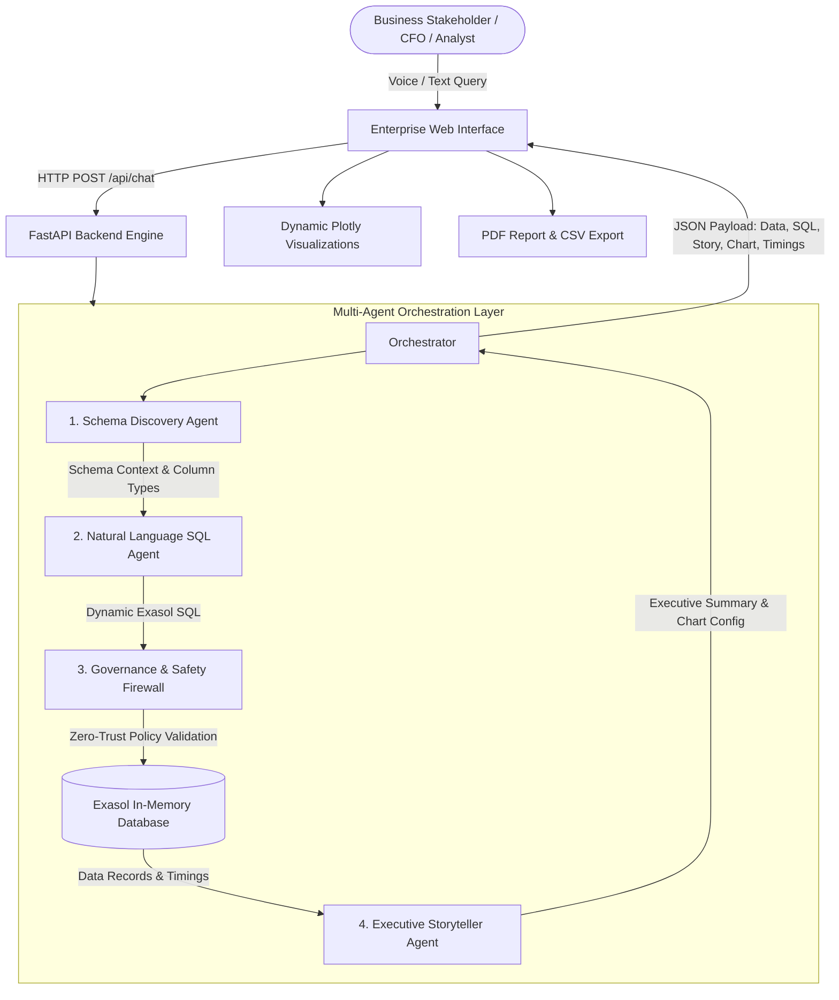

# Aether – Autonomous Multi-Agent BI & Data Steward Copilot

[](https://www.exasol.com/)
[](https://fastapi.tiangolo.com/)
[](https://groq.com/)
[](https://plotly.com/javascript/)
[](LICENSE)

> **Exasol AI Build Challenge 2026 | Autonomous Agents Track**  
> An enterprise-grade, conversational multi-agent analytics platform that translates human business intent into high-performance Exasol SQL queries, validates queries against a zero-trust governance firewall, executes on in-memory columnar data, and delivers interactive visual narratives and executive summaries.

---

## 📌 Executive Summary

Modern enterprise analytics often requires cross-departmental coordination between business leaders, data engineers, and compliance teams. **Aether** eliminates this friction through a collaborative multi-agent architecture:

1. **Non-technical stakeholders** ask strategic questions via voice or text (e.g., *"Compare total revenue by region"* or *"What is the average shipping delay across logistics modes?"*).
2. **Schema & SQL Agents** introspect live Exasol system catalogs and dynamically generate dialect-accurate, high-performance SQL.
3. **Governance Agent** enforces zero-trust security policies, intercepting destructive write operations and verifying read-only safety.
4. **Execution Engine** executes queries against Exasol's in-memory columnar engine in sub-second latencies.
5. **Executive Storyteller Agent** synthesizes the raw data into concise business narratives and autonomously recommends interactive visualizations (Bar, Line, Pie, Scatter).

---

## 🏛️ System Architecture



---

## 🤖 Specialized AI Agents

### 1. 🔍 Schema Discovery Agent (`SchemaAgent`)
* **Role**: Real-time database introspection and metadata cataloging.
* **Capabilities**:
  - Dynamically inspects `EXA_SCHEMAS`, `EXA_ALL_TABLES`, and `EXA_ALL_COLUMNS`.
  - Maps table entities, foreign key relationships, data types (`DECIMAL`, `VARCHAR`, `DATE`), and nullability constraints.
  - Feeds schema context directly into downstream generation pipelines to prevent hallucinated column names.

### 2. ⚡ Natural Language SQL Agent (`SQLAgent`)
* **Role**: 100% dynamic, dialect-precise Exasol SQL generation.
* **Capabilities**:
  - Converts complex natural language queries into optimized Exasol SQL.
  - Implements dialect-specific optimizations: `DAYS_BETWEEN()`, `YEAR()`, strict type casting, and table alias qualification.
  - **Conversational Memory**: Retains multi-turn conversation context for intuitive follow-up analytics.
  - **Multi-Model Failover**: Seamlessly routes across ultra-fast Groq models (`openai/gpt-oss-120b`, `openai/gpt-oss-20b`, `qwen/qwen3.6-27b`) with automatic retry and rate-limit backoff.

### 3. 🛡️ Governance & Safety Firewall Agent (`GovernanceAgent`)
* **Role**: Zero-trust security gatekeeper and read-only compliance enforcer.
* **Capabilities**:
  - Intercepts both the raw user prompt and the generated SQL payload.
  - Strict pattern matching and AST inspection preventing destructive operations (`DROP`, `DELETE`, `UPDATE`, `INSERT`, `ALTER`, `TRUNCATE`, `GRANT`, `REVOKE`).
  - Ensures 100% compliance with read-only enterprise data governance.

### 4. 📊 Executive Storyteller Agent (`StorytellerAgent`)
* **Role**: Strategic narrative synthesis and autonomous visualization inference.
* **Capabilities**:
  - Translates raw multi-row datasets into 1-2 sentence executive briefings highlighting top performers, growth drivers, and anomalies.
  - Analyzes column mathematical distributions to select the optimal chart type (`bar`, `line`, `pie`, `scatter`) and assigns appropriate categorical (X) and numerical (Y) axes.

---

## 🌟 Key Features

* **🎙️ Voice-to-Insights (Groq Whisper)**: Push-to-talk audio input transcribed via `whisper-large-v3-turbo` for hands-free executive query execution.
* **📈 Interactive Chart Switcher**: Autonomously renders recommended charts with single-click manual overrides between Bar, Line, Pie, and Scatter plots.
* **📄 Executive PDF & CSV Reporting**: Instant one-click PDF briefing export with embedded data tables and vector graphics.
* **⚡ Sub-Second Performance**: Leverages Exasol in-memory columnar speed combined with Groq LPU inference.
* **🌓 Modern Glassmorphic UI**: Responsive Dark/Light theme built with modern CSS tokens, micro-animations, and full keyboard accessibility.
* **🛡️ Zero Hardcoding**: Pure dynamic LLM pipeline with multi-model fallback and rate-limit resilience.

---

## 📊 Dataset Schema (TPC-H Benchmark)

Aether is deployed and validated against the standardized **TPC-H** enterprise benchmark schema:

| Table | Description | Key Columns |
| --- | --- | --- |
| `TPCH.CUSTOMER` | Customer demographics & balances | `C_CUSTKEY`, `C_NAME`, `C_ACCTBAL`, `C_MKTSEGMENT`, `C_NATIONKEY` |
| `TPCH.ORDERS` | Transaction records & order status | `O_ORDERKEY`, `O_CUSTKEY`, `O_TOTALPRICE`, `O_ORDERDATE`, `O_ORDERPRIORITY` |
| `TPCH.LINEITEM` | Line-item fulfillment & shipping details | `L_ORDERKEY`, `L_PARTKEY`, `L_EXTENDEDPRICE`, `L_DISCOUNT`, `L_SHIPMODE`, `L_RETURNFLAG` |
| `TPCH.PART` | Product catalog & pricing | `P_PARTKEY`, `P_NAME`, `P_MFGR`, `P_BRAND`, `P_TYPE`, `P_RETAILPRICE` |
| `TPCH.SUPPLIER` | Supplier records & inventory accounts | `S_SUPPKEY`, `S_NAME`, `S_NATIONKEY`, `S_ACCTBAL` |
| `TPCH.PARTSUPP` | Part-supplier availability & costs | `PS_PARTKEY`, `PS_SUPPKEY`, `PS_AVAILQTY`, `PS_SUPPLYCOST` |
| `TPCH.NATION` | Geographic nations & regional keys | `N_NATIONKEY`, `N_NAME`, `N_REGIONKEY` |
| `TPCH.REGION` | Global continents & economic regions | `R_REGIONKEY`, `R_NAME` |

---

## 📂 Project Structure

```
Exasol-Aether/
├── agents/
│   ├── schema_agent.py          # Real-time catalog introspection & column mapping
│   ├── sql_agent.py             # Dynamic Exasol SQL generator with multi-model failover
│   ├── governance_agent.py      # Zero-trust read-only firewall & compliance policies
│   ├── storyteller_agent.py     # Executive summary synthesis & chart inference
│   └── orchestrator.py          # End-to-end multi-agent pipeline coordinator
├── frontend/
│   ├── app.py                   # Streamlit alternative interface
│   └── static/
│       ├── index.html           # Modern glassmorphic Enterprise Web UI
│       └── app.js               # Plotly chart renderer, voice STT, PDF export & theme engine
├── utils/
│   └── db.py                    # Thread-safe PyExasol connection manager with TLS/SSL
├── server.py                    # FastAPI server exposing /api/chat and /api/voice
├── test_connection.py           # Connectivity validation script
├── test_full_flow.py            # End-to-end pipeline verification test
├── test_governance.py           # Firewall security unit tests
├── requirements.txt             # Project Python dependencies
├── .env.example                 # Environment variables template
└── README.md                    # Project documentation
```

---

## 🚀 Quickstart Guide

### Prerequisites

* Python 3.10+
* Active **Exasol Database** instance (Exasol Personal, Docker Starter Kit, or Cloud Cluster)
* **Groq API Key** ([console.groq.com](https://console.groq.com))

### 1. Clone & Configure Environment

```bash
# Clone the repository
git clone https://github.com/your-org/Exasol-Aether.git
cd Exasol-Aether

# Create and activate virtual environment
python -m venv venv
# On Windows:
.\venv\Scripts\Activate
# On Linux/macOS:
source venv/bin/activate

# Install dependencies
pip install -r requirements.txt
```

### 2. Configure Environment Variables

Create a `.env` file in the root directory:

```env
EXA_DSN=your-cluster.exasol.com:8563
EXA_USER=your_username
EXA_PASSWORD=your_password
GROQ_API_KEY=gsk_your_groq_api_key
```

### 3. Verify Database Connection

```bash
python test_connection.py
```

### 4. Launch the Enterprise Platform

Start the FastAPI application with live reloading:

```bash
python server.py
# Or directly via uvicorn:
uvicorn server:app --host 0.0.0.0 --port 8000 --reload
```

Open your browser at **`http://localhost:8000/app/index.html`**.

---

## 📡 API Reference

### `POST /api/chat`
Submits a natural language query through the multi-agent pipeline.

* **Request Body**:
  ```json
  {
    "prompt": "Compare total revenue by region.",
    "history": [
      { "role": "user", "content": "Previous question" },
      { "role": "assistant", "content": "Previous answer summary" }
    ]
  }
  ```

* **Response Body**:
  ```json
  {
    "success": true,
    "question": "Compare total revenue by region.",
    "sql": "SELECT r.R_NAME AS REGION, ROUND(SUM(l.L_EXTENDEDPRICE * (1 - l.L_DISCOUNT)), 2) AS TOTAL_REVENUE FROM TPCH.LINEITEM l JOIN TPCH.ORDERS o ON l.L_ORDERKEY = o.O_ORDERKEY JOIN TPCH.CUSTOMER c ON o.O_CUSTKEY = c.C_CUSTKEY JOIN TPCH.NATION n ON c.C_NATIONKEY = n.N_NATIONKEY JOIN TPCH.REGION r ON n.N_REGIONKEY = r.R_REGIONKEY GROUP BY r.R_NAME ORDER BY TOTAL_REVENUE DESC;",
    "row_count": 5,
    "data": [
      ["AMERICA", "10038458.23"],
      ["EUROPE", "8842209.72"],
      ["MIDDLE EAST", "8262696.42"],
      ["AFRICA", "8151631.45"],
      ["ASIA", "7799438.14"]
    ],
    "columns": ["REGION", "TOTAL_REVENUE"],
    "summary": "America generates the highest total net revenue at $10.04M, followed by Europe at $8.84M.",
    "chart_config": {
      "type": "bar",
      "x": "REGION",
      "y": "TOTAL_REVENUE"
    },
    "timings": {
      "schema": 350,
      "sql": 720,
      "governance": 1,
      "execution": 180,
      "storyteller": 650
    }
  }
  ```

### `POST /api/voice`
Transcribes audio recordings into clean text via Groq Whisper (`whisper-large-v3-turbo`).

* **Request**: `multipart/form-data` with `file` (WAV/WebM audio payload).
* **Response**: `{"success": true, "text": "Who are the top 10 customers by total spend?"}`

---

## 🔒 Security & Governance

Aether operates under a strict **Zero-Trust Security Architecture**:
* **Read-Only Enforcement**: Dual-layer inspection blocks any SQL containing modifying keywords (`INSERT`, `UPDATE`, `DELETE`, `DROP`, `TRUNCATE`, `ALTER`, `GRANT`, `REVOKE`).
* **Dialect Sanitization**: Ensures all input queries are constrained to valid `SELECT` statements with parameter bounds.
* **Credentials Isolation**: Database passwords and API keys are strictly loaded via `.env` and never logged or exposed to the client.

---

## 🏆 Exasol Hackathon Highlights

1. **True Multi-Agent Collaboration**: Specialized separation of concerns between Schema Introspection, SQL Synthesis, Security Governance, and Executive Storytelling.
2. **Exasol In-Memory Columnar Speed**: Sub-second execution on complex multi-table joins across millions of rows.
3. **Enterprise Usability**: Voice input, conversational memory, dynamic charts, CSV exports, and executive PDF generation designed for real business leaders.
